<p align="center">
  
</p>

<p align="center">
  <a href="https://drive.google.com/file/d/1cpCgA5vv7mbLdbmAC9HnWPmupHSinxmr/view?usp=sharing"></a>
  &nbsp;
  <a href="https://drive.google.com/file/d/1QexndWk7lMKnshtv-0Utz48jL59ye5Rq/view?usp=sharing"></a>
  &nbsp;
  <a href="https://mosaic-os-black.vercel.app"></a>
  &nbsp;
  <a href="docs/DEMO_SCRIPT.md"></a>
</p>

<table align="center">
<tr>
<td align="center"><b>Demo video</b><br><a href="https://drive.google.com/file/d/1cpCgA5vv7mbLdbmAC9HnWPmupHSinxmr/view?usp=sharing">mOSaic running live, every screen</a></td>
<td align="center"><b>Explainer video</b><br><a href="https://drive.google.com/file/d/1QexndWk7lMKnshtv-0Utz48jL59ye5Rq/view?usp=sharing">the idea in a few minutes</a></td>
<td align="center"><b>Website</b><br><a href="https://mosaic-os-black.vercel.app">mosaic-os-black.vercel.app</a></td>
<td align="center"><b>3-minute video script</b><br><a href="docs/pitch/VIDEO_SCRIPT.md">voice-over and shot list</a></td>
</tr>
</table>

<p align="center">
  
  
  
  
  
  
  
  
  
  
</p>

<br>

> **mOSaic is not another chatbot. It is the runtime that organizational AI lives in.**
> Company knowledge is mounted as a filesystem. Agents are processes with PIDs, quotas and capabilities, created for
> the job in hand. Every action that touches the outside world is a syscall that policy can stop, a person can
> approve, a sandbox can contain and a hash-chained journal records. People sign in with roles; they use it from a
> desktop in the browser, from their phone, or from a Linux shell. All of it runs on one machine, on local models.

<p align="center">
  
</p>

---

## Contents

[Why](#why-mosaic) · [The OS idea](#the-os-idea) · [Three ways in](#three-ways-in) · [See it run](#see-it-run) · [Four scored scenarios](#four-scenarios-scored-on-every-merge) · [Agents made for the job](#agents-made-for-the-job) · [Architecture](#architecture) · [Governed syscalls](#governed-syscalls) · [Knowledge and memory](#knowledge-that-remembers-where-it-came-from) · [People and roles](#people-roles-and-sign-in) · [Apps and files](#connected-apps-and-your-own-files) · [Settings](#the-settings-centre) · [Agents as processes](#agents-are-processes) · [mOSaic OS](#mosaic-os-a-linux-where-org-is-a-filesystem) · [The phone](#the-phone) · [Run it](#run-it) · [Repository map](#repository-map) · [Team](#team)

---

## Why mOSaic

Organizations want AI that can **act** on their private knowledge: update the tracker, file the report, chase the vendor. Today that means choosing between three bad options.

<table>
<tr>
<td width="33%" valign="top">

**It leaves the building.**<br>
Cloud agents need your finance sheets, tickets and email in someone else's data centre. For many teams that is a non-starter.

</td>
<td width="33%" valign="top">

**It acts without asking.**<br>
An agent that can call tools can also call the wrong one. "The model decided to" is not an audit trail, and one poisoned email can steer it.

</td>
<td width="33%" valign="top">

**It forgets where facts came from.**<br>
Answers arrive without sources, memories never expire, and when a document changes nobody knows which conclusions are now wrong.

</td>
</tr>
</table>

mOSaic answers all three the way operating systems answered them for programs: **isolation, permissions, a kernel that mediates every privileged operation, and a journal.** Then it gives the people using it what an operating system gives its users: accounts, a desktop, a shell, and a way in from their phone.

---

## The OS idea

<p align="center">
  
</p>

<p align="center">
  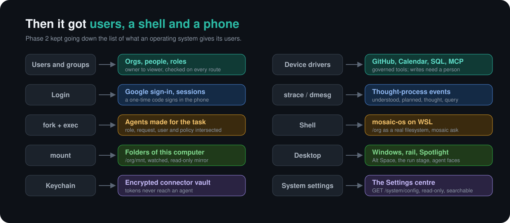
</p>

---

## Three ways in

The same kernel, the same permissions and the same audit journal, whichever door you use.

<table>
<tr>
<td width="50%" valign="top">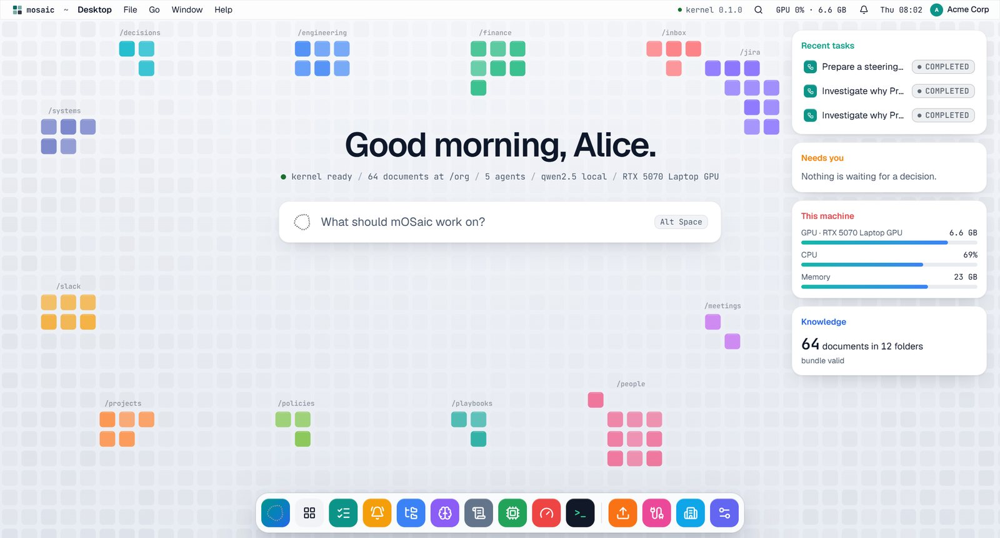<br><b>The desktop</b> (<code>apps/web</code>). The console is an operating system in the browser: windows, a menu bar, a command rail, Alt Space for a floating Ask bar, and a wallpaper that <i>is</i> your knowledge. Every coloured tile is one document in <code>/org</code>, grouped by folder, and it lights up when an agent reads it.</td>
<td width="50%" valign="top">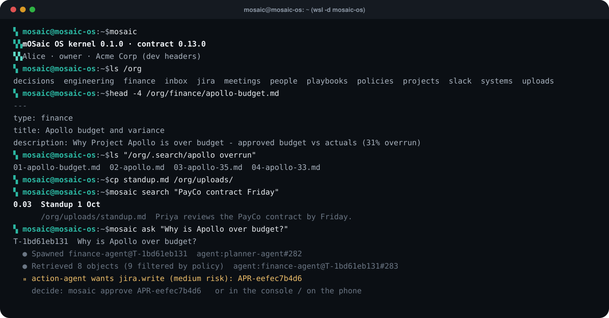<br><b>mOSaic OS</b> (<code>scripts/wsl</code>). A Linux distro where <code>/org</code> is a real filesystem served live by the kernel. <code>cat</code> a document, <code>ls</code> a search, <code>cp</code> a file in and agents can read it seconds later, <code>mosaic ask</code> to watch a run from the shell.</td>
</tr>
</table>

<table>
<tr>
<td width="25%">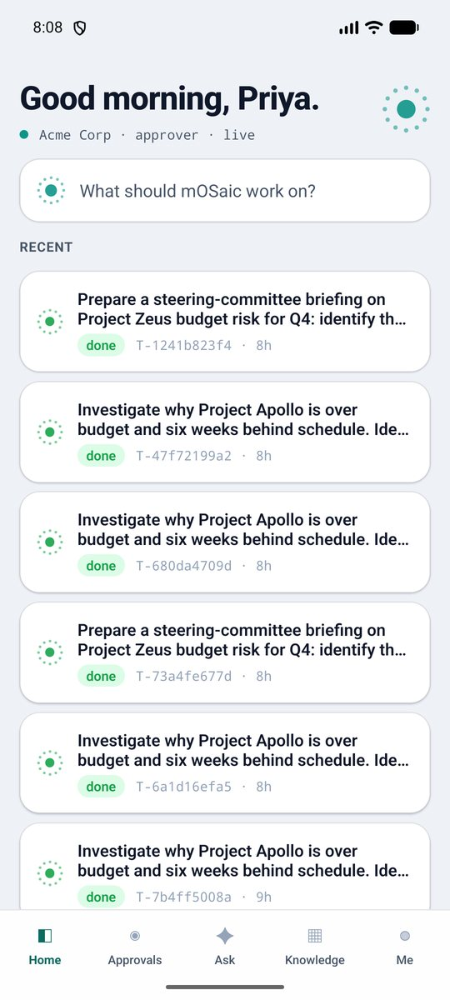</td>
<td width="25%">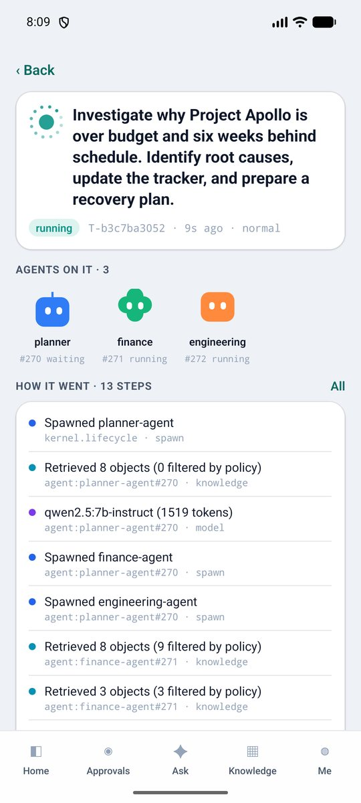</td>
<td width="25%">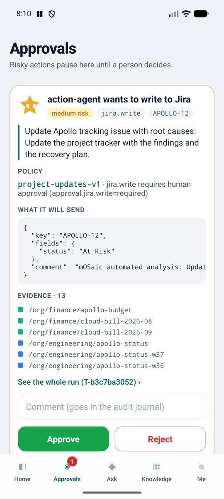</td>
<td width="25%" valign="top"><b>The phone</b> (<code>apps/mobile</code>). Sign in with a one-time code from the console, or with Google. Watch a run live with agents as faces, get a notification when an action needs you, and approve it from the card that shows the policy, the exact payload and the evidence. A real Android APK, built and tested.</td>
</tr>
</table>

---

## See it run

One goal, typed into the desktop with Alt Space. Five agents, one approval, a cited answer, no cloud. **[Watch the full run in the demo video.](https://drive.google.com/file/d/1cpCgA5vv7mbLdbmAC9HnWPmupHSinxmr/view?usp=sharing)**

> *"Investigate why Project Apollo is over budget and six weeks behind schedule. Identify root causes, update the tracker, and prepare a recovery plan."*

<p align="center">
  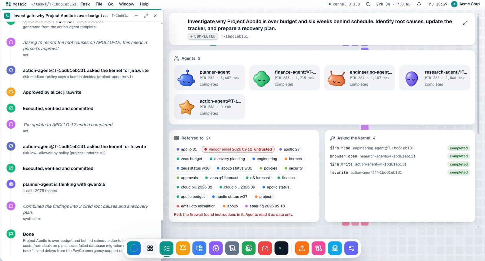
</p>

<table>
<tr>
<td width="33%" valign="top"><b>1. The task docks left and tells its story.</b> What the planner understood, which agents it created and why, what each one is thinking, every model call, retrieval and tool call, in order. The <code>--check-story</code> gate checks that order on every scored run.</td>
<td width="33%" valign="top"><b>2. The run stage shows what is happening.</b> Agents are faces that work, wait and doze. Every document an agent reads appears under "Referred to"; the vendor email that hides a prompt injection is red and marked untrusted: agents read it as data only.</td>
<td width="33%" valign="top"><b>3. A person decides, then the kernel commits.</b> Writing to Jira is a privileged syscall, so policy pauses it. Approve from the desktop, the phone or the shell; the write executes, is verified, is committed, and lands in a hash-chained audit journal.</td>
</tr>
</table>

The answer: Apollo is **31% (6.2 lakh) over budget**, with three root causes (dual-running pipelines during a database migration, a failed backfill on APOLLO-12, and an emergency PayCo support contract while the SDK slipped), each cited to the documents it came from, a recovery plan, the research agent's screenshot of the vendor's status page taken in a sandbox with no internet, and `chain_verified: true`.

<details>
<summary><b>The same run as a sequence diagram</b></summary>

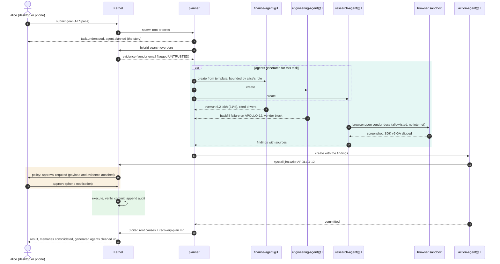

</details>

---

## Four scenarios, scored on every merge

Nothing here is a recording. Each scenario is a real run on `qwen2.5:7b-instruct`, scored by `scripts/demo_run.py` on checks that matter: the right approval, the injection never obeyed, causes that are cited, the numbers right, the audit chain intact, the story in order.

| Scenario | The ask | What it proves | Score | Time |
|---|---|---|---|---|
| **Apollo** | Why is Project Apollo over budget and late? Update the tracker, plan a recovery. | Planner and specialists, firewall, sandboxed browser, one approved write, cited causes | **8/8**, story PASS | about 100 s |
| **Zeus** | Brief the steering committee on Project Zeus's Q4 budget risk. | Same agents, different project: nothing is scripted for Apollo; a reworded injection | **8/8**, story PASS | about 110 s |
| **Vendors** | Which vendors were paid more than their contract in Q3? Draft a note to finance. | A data engineer made for the task writes SQL the kernel checks; a writer files the note after approval | **8/8**, story PASS | about 21 s |
| **Multitool** | One task that needs SQL, the browser, the knowledge base and a write. | Every tool kind in one governed run | **8/8**, story PASS | about 44 s |
| Zeus, LLM classifier on | as Zeus, with `MOSAIC_FIREWALL_LLM=true` | The classifier catches the injection the regex misses | **9/9** | about 104 s |

```bash
uv run python scripts/demo_run.py run --auto-approve --check-story                      # Apollo
uv run python scripts/demo_run.py run --auto-approve --check-story --scenario zeus      # also vendors, multitool
```

---

## Agents made for the job

Ask something nobody scripted and the planner does not reach for a fixed cast: it **creates agents for the task**, each named after it (`data-engineer@T-c25ba73055`), each generated from a role template, and each bounded four ways at once.

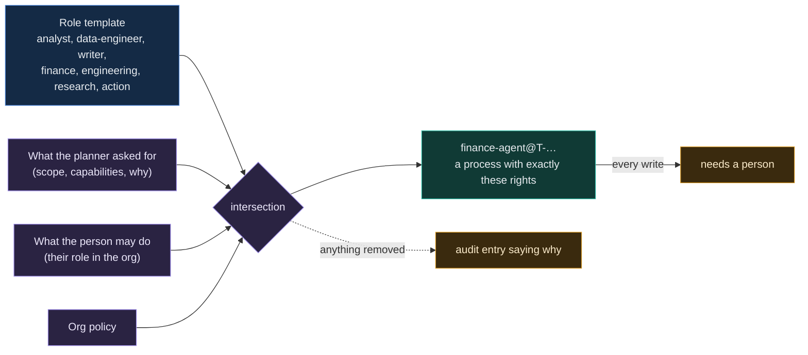

<table>
<tr>
<td width="60%">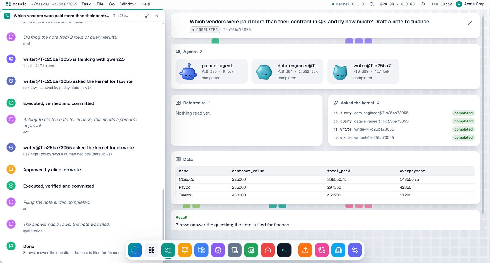</td>
<td width="40%" valign="top"><b>The thought process, visible.</b> Agents narrate in short, checkable steps (<code>task.understood</code>, <code>agent.planned</code>, <code>agent.created</code>, <code>agent.thought</code>), and the kernel, not the agent, reports what tools returned (<code>tool.query</code>, <code>task.data</code>), so an agent cannot fake a query result.<br><br><b>SQL with a seatbelt.</b> <code>db.query</code> is read-only; the kernel checks every statement before it runs (one statement, no DDL, a row limit). <code>db.write</code> waits for a person. The answer comes back as a table: CloudCo overpaid by 1.44 lakh, PayCo by 0.42, TalentX by 0.11.</td>
</tr>
</table>

Generated manifests are removed when the task ends and swept at boot. Apollo's and Zeus's planning prompts are byte-identical to before dynamic agents, so the scored runs did not move.

---

## Architecture

<p align="center">
  
</p>

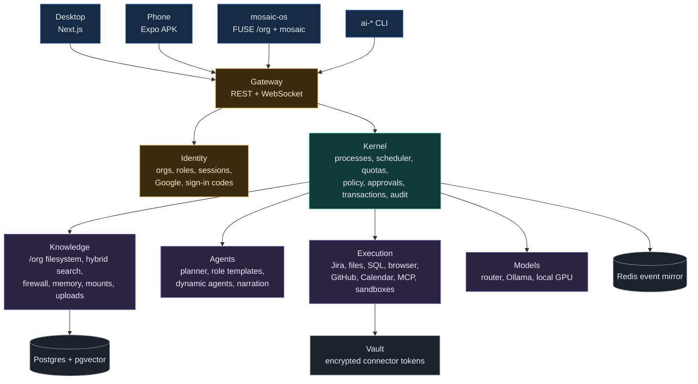

Every box is a separate package behind a typed contract (`shared/`: Pydantic models exported to JSON Schema, OpenAPI and TypeScript, now at **0.13.0**). Each component ships a **fake** and a **real** implementation, switchable per component (`MOSAIC_MODE_<COMPONENT>=fake|real`). That is how four people built it in parallel, and how the console and the phone run without a GPU against the contract's mock gateway.

---

## Governed syscalls

<p align="center">
  
</p>

Policies are plain YAML in [`policies/`](policies) and hot-reload while the system runs. A rule can allow, deny or require approval per capability, per agent and per data scope, and the approver sees exactly which documents justify the action before anything happens. Writes to Jira, GitHub, Calendar and the database all wait for a person by default; a generated agent's policy requires approval for every write whatever the org policy says.

---

## Knowledge that remembers where it came from

```mermaid
flowchart LR
    classDef doc fill:#142A45,stroke:#4C86D9,color:#E8ECF0
    classDef guard fill:#3D1618,stroke:#E05252,color:#F8D7D7
    classDef mem fill:#1F3A1A,stroke:#2FB344,color:#DDF5E1
    classDef agent fill:#2A2342,stroke:#9D8CE8,color:#ECE8FB
    classDef evt fill:#3A2A0E,stroke:#D99A25,color:#FBEBCB

    S1["Uploads"]:::doc --> D
    S2["Folders of this computer<br/>/org/mnt, watched"]:::doc --> D
    S3["GitHub, Calendar sync"]:::doc --> D
    D["/org Markdown<br/>+ frontmatter"]:::doc --> I[("Index<br/>lexical + pgvector + graph")]:::doc
    I --> Q{"hybrid<br/>search"}:::doc
    Q -->|policy scope,<br/>privacy| FW["Context<br/>firewall"]:::guard
    FW -->|clean| C["Agent context"]:::agent
    FW -->|instruction-like| U["UNTRUSTED<br/>quoted as data"]:::guard
    U --> C
    C --> F["Finding + citations"]:::agent
    F --> M[("Memory<br/>derived_from = sources")]:::mem
    X["A source document<br/>is edited"]:::evt --> W["Watcher reindexes"]:::evt
    W --> V["memory.invalidated"]:::evt
    V --> M
    V --> T["Desktop: Source changed,<br/>N memories stale"]:::evt
    M -->|stale| R["memory.reconsolidate"]:::evt
    R -->|~3.5 s| NM["Re-derived memory<br/>replaces old record"]:::mem
```

- **A filesystem, not a vector dump.** `/org/finance/apollo-budget` is a path with an owner, a privacy level, a trust level and a source. Search blends lexical, semantic and graph scores (10/10 on the QA set, MRR 0.90) and shows all three.
- **Documents are data, never instructions.** The demo bundle hides prompt injections in vendor emails. The regex firewall is always on; an optional local LLM classifier (`MOSAIC_FIREWALL_LLM=true`) catches 3 to 4 of 5 reworded injections with zero false positives. Agents receive flagged text as quoted data.
- **Policy filters before the model sees anything.** Payroll never reaches an agent without the scope; the console shows "N filtered by policy" instead.
- **Memory with provenance.** Every memory records the documents it was derived from. Change one, and exactly the dependent memories go stale within 0.1 s; within about 3.5 s they are re-derived from the new text and the Memory app shows a "re-derived" chip with the record it replaced.
- **Your own files.** Drop documents into the desktop (PDF, Word, PowerPoint, Excel, Markdown, text, code), `cp` them into `/org` from mOSaic OS, or mount a whole folder: it is converted, indexed and searchable in seconds, and edits flow in as you save.

---

## People, roles and sign-in

<table>
<tr>
<td width="50%">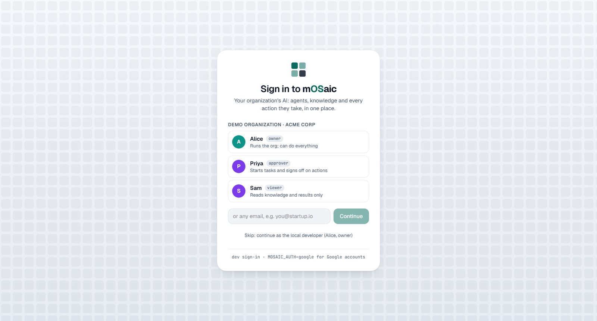</td>
<td width="50%">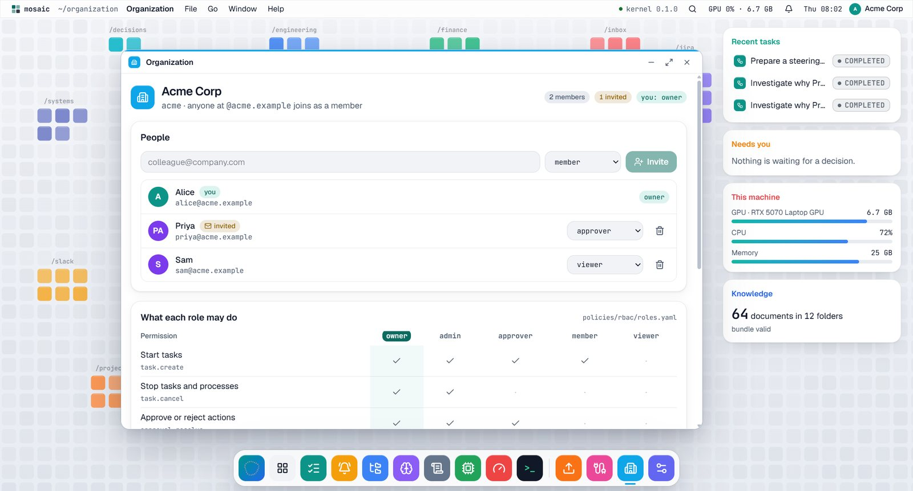</td>
</tr>
</table>

`MOSAIC_AUTH=google` signs people in with their Google accounts (the gateway verifies the ID token); `dev` keeps email sign-in for demos. A new person creates an organization or joins one by email domain; admins invite by email. Every gateway route checks the caller's permission (403 `PERMISSION_DENIED`), and the desktop and the phone hide what a role cannot use, with a note saying so. The same role bounds the agents a person's task may create.

| Permission | viewer | member | approver | admin | owner |
|---|:-:|:-:|:-:|:-:|:-:|
| Read `/org` and results | yes | yes | yes | yes | yes |
| Start tasks | | yes | yes | yes | yes |
| Approve or reject actions | | | yes | yes | yes |
| Stop tasks and processes | | | | yes | yes |
| Add knowledge, mount folders | | | | yes | yes |
| Connect GitHub, Calendar | | | | yes | yes |
| See system settings | | | | yes | yes |
| Invite and manage people | | | | yes | yes |
| Change system settings | | | | | yes |

From [`policies/rbac/roles.yaml`](policies/rbac/roles.yaml). **Sign in on your phone:** the desktop's user menu shows an eight-character code for five minutes; typing it into the app (or `mosaic login CODE` in mOSaic OS) gives that device a session of its own for the same person.

---

## Connected apps and your own files

<table>
<tr>
<td width="50%">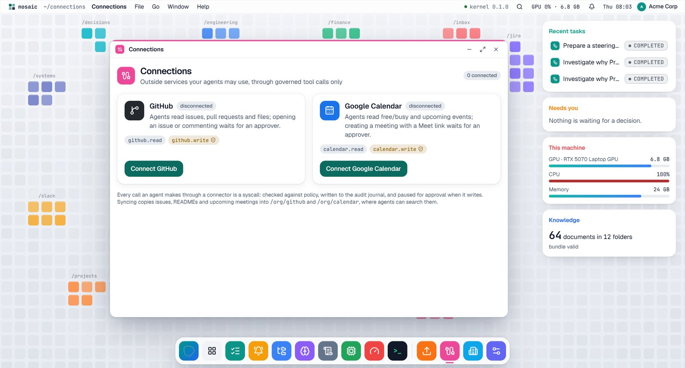</td>
<td width="50%">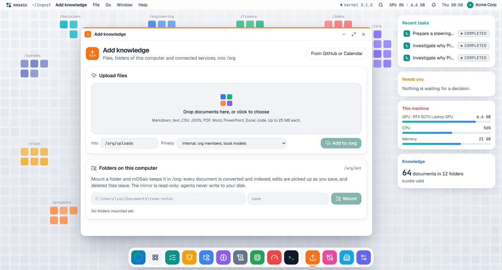</td>
</tr>
<tr>
<td valign="top"><b>Connections.</b> GitHub and Google Calendar are governed tools: <code>github.read</code> and <code>calendar.read</code> are allowed, <code>github.write</code> and <code>calendar.write</code> wait for an approver. Tokens are encrypted in a vault (Fernet, <code>MOSAIC_VAULT_KEY</code>), never shown again, never given to an agent. Without a token they run on built-in demo data. Sync brings issues, READMEs and upcoming meetings into <code>/org</code>.</td>
<td valign="top"><b>Add knowledge.</b> Drag files in and watch each one go received, converted, indexed. Mount a folder of this computer and mOSaic mirrors it into <code>/org/mnt/&lt;name&gt;</code>, read-only, watched: save a file and it is re-ingested, delete it and it leaves. Folders inside mOSaic OS work too.</td>
</tr>
</table>

---

## The Settings centre

<p align="center">
  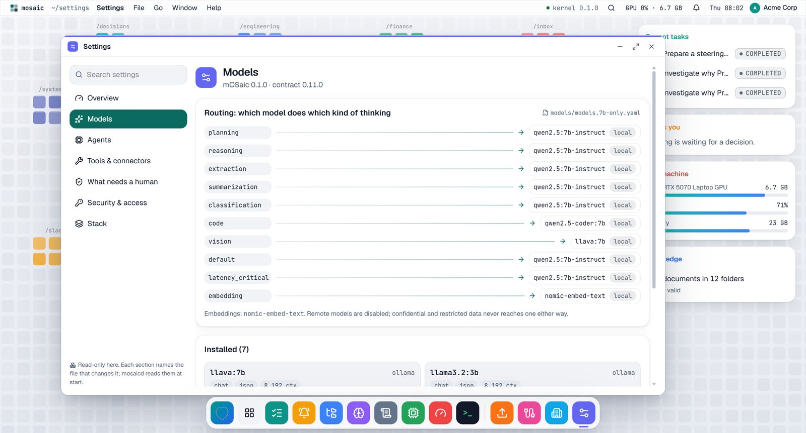
</p>

One read-only picture of the running system from `GET /system/config`: which model does which kind of thinking, every agent manifest and its limits, every tool and its risk, **what needs a human** across all policies, how people sign in and whether the vault is encrypted, and the stack as layers with live health. Search finds a setting in any section, and each section names the file that changes it. Credentials are always redacted.

---

## Agents are processes

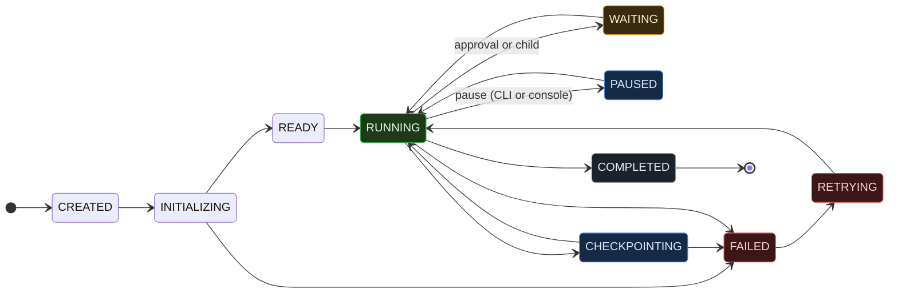

Every non-final state can also move to `TERMINATED` (a kill; a killed task is cancelled before its children, so it never ends as completed). The legal transitions live in the contract, so the kernel, the CLI and the console's buttons all agree. Model outages are retried with backoff: restart Ollama in the middle of an Apollo run and the run still scores 8/8. If the kernel itself dies, unfinished tasks resume from their last checkpoint.

| From a terminal | What it does |
|---|---|
| `ai-ps` · `ai-tree` · `ai-top` | the process table, a task's process tree, live CPU, RAM, GPU and tokens |
| `ai-kill <pid>` · `ai-checkpoint` · `ai-resume` | terminate (audited), snapshot and resume |
| `ai-audit <task>` | the hash-chained journal of a task |
| `ai run "<goal>"` · `ai approve <id>` | start and steer work; `MOSAIC_TOKEN` signs in with a session |

---

## mOSaic OS: a Linux where /org is a filesystem

<p align="center">
  
</p>

```powershell
powershell -File scripts\wsl\install-mosaic-os.ps1     # creates the mosaic-os distro; no other distro is touched
wsl -d mosaic-os                                        # or pick it in Windows Terminal
```

| | |
|---|---|
| `ls /org`, `cat /org/finance/apollo-budget.md` | the organization's knowledge as files, with their frontmatter |
| `ls "/org/.search/apollo overrun"` | hybrid search as a directory: the hits are links to the documents |
| `cp notes.md /org/uploads/` | add knowledge; existing documents are read-only (changes go through governed paths) |
| `mosaic ask "..."` | start a task and watch it, step by step, until the approval and the answer |
| `mosaic approve APR-…`, `mosaic search`, `mosaic mount ~/notes` | decide, search, keep a folder of this machine in `/org/mnt` |
| `mosaic login K7QM-4ZPD` | sign in with a code from the desktop |

A FUSE filesystem and a systemd service, a standard-library `mosaic` command, and a login banner. Details and internals in [`docs/MOSAIC_OS.md`](docs/MOSAIC_OS.md).

---

## The phone

An Expo (SDK 57) app in [`apps/mobile`](apps/mobile), built as an Android APK by `apps/mobile/scripts/build-apk.ps1`.

| | |
|---|---|
| **Sign in** | the demo org's people or any email in dev mode, a one-time code from the desktop, or native Google sign-in in the APK |
| **Home** | your org and role, live status, what needs you, running tasks with thinking orbs |
| **A run** | agents as faces, the story from the audit journal, the answer with its evidence; stop it if your role allows |
| **Approvals** | the agent, capability, risk, policy, justification, exact payload and evidence; approve or reject with a comment |
| **Ask, Knowledge, Me** | start work (if your role may), search `/org`, see what your role lets you do |
| **Notifications** | a new approval or a finished task, while the app is open or recently in the background (no push server) |

Verified on the Android emulator: an Apollo run started from the phone and approved from its notification scored 8/8. Every text colour meets WCAG AA (`npm run contrast`).

---

## Run it

The fastest way to see every screen without a GPU is the contract mock:

```bash
uv run mosaic-mock-gateway --speed 2          # replays a full Apollo run on :8080, pauses at the approval
cd apps/web && NEXT_PUBLIC_MOSAIC_URL=http://localhost:8080 npm run dev
```

### Quick start

**You need:** Python 3.12 with [uv](https://docs.astral.sh/uv/), Docker, Node 20+ and [Ollama](https://ollama.com) on an NVIDIA GPU (8 GB is enough).

```bash
git clone https://github.com/Kamalllx/mOSaic && cd mOSaic
uv sync --all-packages --all-extras

# services: Postgres + pgvector, Redis, and the internal vendor site the browser agent visits
docker compose -f infra/compose/docker-compose.yml up -d postgres redis vendor-docs
docker build -t mosaic/sandbox-base:latest    execution/images/sandbox-base
docker build -t mosaic/sandbox-browser:latest execution/images/sandbox-browser

# local models
ollama pull qwen2.5:7b-instruct && ollama pull nomic-embed-text

# the real stack (see .env.example for every setting)
export MOSAIC_DEFAULT_MODE=real MOSAIC_OKF_DIR=./data/okf MOSAIC_KNOWLEDGE_WATCH=true \
       MOSAIC_MODELS_CONFIG=./models/models.7b-only.yaml MOSAIC_GATEWAY_PORT=8089
uv run mosaicd
curl -X POST http://localhost:8089/knowledge/reindex      # index the demo bundle once
uv run python scripts/seed_demo_data.py                   # the demo company's database (vendors, multitool)

# the desktop
cd apps/web && echo "NEXT_PUBLIC_MOSAIC_URL=http://localhost:8089" > .env.local
npm ci && npm run build && npx next start -p 3000          # open http://localhost:3000
```

<details>
<summary><b>People, Google sign-in, the vault</b></summary>

| Setting | |
|---|---|
| `MOSAIC_AUTH=dev` (default) | email sign-in and header callers; the demo org has Alice (owner), Priya (approver) and Sam (viewer) |
| `MOSAIC_AUTH=google`, `MOSAIC_GOOGLE_CLIENT_ID` | Google accounts; the OAuth **web** client ID; add the desktop's origin to its JavaScript origins |
| `MOSAIC_VAULT_KEY` | 32 random bytes (base64) encrypting connector tokens; `scripts/win/start-mosaicd.ps1` makes one in `.data` |
| `MOSAIC_SESSION_HOURS` | how long a sign-in lasts (12) |

</details>

<details>
<summary><b>The phone and mOSaic OS</b></summary>

```powershell
powershell -File apps\mobile\scripts\build-apk.ps1           # apps/mobile/dist/mosaic-<version>.apk
adb install -r apps\mobile\dist\mosaic-1.1.0.apk
adb reverse tcp:8089 tcp:8089                                # a phone on USB reaches the laptop as localhost
powershell -File scripts\wsl\install-mosaic-os.ps1           # then: wsl -d mosaic-os
```

On a hotspot or Wi-Fi, `scripts\win\phone-access.ps1` (as administrator) opens the firewall and prints the address. See [`apps/mobile/README.md`](apps/mobile/README.md) and [`docs/MOSAIC_OS.md`](docs/MOSAIC_OS.md).
</details>

<details>
<summary><b>Windows laptop notes</b></summary>

[`docs/HANDOFF-KAMAL.md`](docs/HANDOFF-KAMAL.md) has the full Windows setup: PowerShell equivalents, port clashes (a native Postgres on 5432, Redis in WSL), `127.0.0.1` instead of `localhost` for Docker ports, and the Ollama settings that keep a 7B model entirely on an 8 GB GPU. `scripts/win/mosaic-boot.ps1` starts everything and opens the boot screen in Edge kiosk mode; `scripts/preflight.py` must print "all green" before a demo; `scripts/win/reset-demo.ps1` resets between rehearsals.
</details>

**Tests and gates:** `uv run pytest -q` (442 tests, including a 10/10 retrieval QA on the demo bundle) · `npm --prefix apps/web test` (93, including WCAG AA contrast for both themes) · `npm --prefix apps/mobile run typecheck` and `run contrast` · `uvx ruff check .` · and the four scored scenarios above, on real models, before every merge.

---

## Repository map

| Path | What lives there |
|---|---|
| [`kernel/`](kernel) · [`mosaicd/`](mosaicd) | process table, scheduler, policy engine, approvals, transactions, audit journal, dynamic agents, identity (orgs, roles, sessions, vault), the gateway, the `ai-*` CLI |
| [`knowledge/`](knowledge) | the `/org` filesystem, converters, indexing, hybrid retrieval, context firewall, memory and coherence |
| [`agents/`](agents) · [`models/`](models) | role templates and the agent library (planner, finance, engineering, research, action, analyst, data-engineer, writer), narration, the model router, NOOA adapter |
| [`execution/`](execution) | tools: Jira, files, SQL, browser (Playwright or the MCP browser), GitHub, Calendar, MCP; Docker sandboxes, artifacts |
| [`apps/web/`](apps/web) | the desktop: windows, rail, Spotlight, the run stage, sign-in, Organization, Connections, Add knowledge, Settings |
| [`apps/mobile/`](apps/mobile) | the phone app and its APK build |
| [`scripts/wsl/`](scripts/wsl) | mOSaic OS: the installer, the FUSE `/org`, the `mosaic` command |
| [`shared/`](shared) | the contract (0.13.0): schemas, interfaces, fakes, event and error catalogs, OpenAPI, generated TypeScript, the mock gateway |
| [`policies/`](policies) | YAML policies (hot-reloaded), `rbac/roles.yaml` (what people may do), `rbac/role-capabilities.yaml` (what their agents may do) |
| [`data/okf/`](data/okf) | the demo company: 64 documents across finance, engineering, Jira, Slack, email, meetings and policy |
| [`infra/`](infra) · [`scripts/`](scripts) | compose files, the appliance installer, preflight, demo scoring, the demo database seed, kiosk boot scripts |

<details>
<summary><b>The contract, version by version</b></summary>

| Version | Change |
|---|---|
| 0.4.0 | Handoff baseline: four splits integrated |
| 0.5.0 | `Settings.models_config` (`MOSAIC_MODELS_CONFIG`) |
| 0.6.0 | `RunTimeline.chain_verified` |
| 0.7.0 | `EmbedRequest.input_type` for nomic prefixes (MRR 0.83 to 0.90) |
| 0.8.0 | `Settings.firewall_llm` and the `instruction_like_llm` flag |
| 0.9.0 | `GET /system/config` |
| 0.10.0 | identity, connectors, mounts and uploads; thought-process events and `ctx.narrate` |
| 0.11.0 | sign-in codes for the phone; dynamic agents |
| 0.12.0 | the db tool |
| 0.13.0 | the two phase-2 lines joined |

</details>

| Read next | |
|---|---|
| [`docs/PROJECT_CONTEXT.md`](docs/PROJECT_CONTEXT.md) | the complete project context: what is built, the API, how to run it, the rules |
| [`docs/DEMO_SCRIPT.md`](docs/DEMO_SCRIPT.md) · [`docs/pitch/VIDEO_SCRIPT.md`](docs/pitch/VIDEO_SCRIPT.md) | the live demo run sheet and fallbacks; the 3-minute video's voice-over and shots |
| [`docs/MOSAIC_OS.md`](docs/MOSAIC_OS.md) · [`apps/mobile/README.md`](apps/mobile/README.md) | mOSaic OS; the phone and its APK |
| [`docs/team/B-PHASE2-HANDOFF.md`](docs/team/B-PHASE2-HANDOFF.md) | dynamic agents, the thought process, the SQL tool and the MCP browser |
| [`Mosaic_Preoject_Description.md`](Mosaic_Preoject_Description.md) · [`docs/MASTER_PLAN.md`](docs/MASTER_PLAN.md) | the full architecture blueprint and how the work was split |
| [`AGENTS.md`](AGENTS.md) · [`shared/README.md`](shared/README.md) | the rules for contributors and coding agents, and how to change the contract |

---

## Where it started: the phase-1 console

Before the desktop, mOSaic's console was a dark operator console built for a projector. The kernel, the syscalls and the journal underneath are the same.

<table>
<tr>
<td width="33%"><br><b>Boot</b>: the services tick off in order, then the console opens.</td>
<td width="33%"><br><b>A live task</b>: the timeline, the process tree, the inspector.</td>
<td width="33%"><br><b>Approval</b>: risk, policy, arguments and evidence.</td>
</tr>
<tr>
<td><br><b>Result</b>: cited causes, the plan, the sandbox screenshot.</td>
<td><br><b>Memory</b>: a source changed, memories went stale.</td>
<td><br><b>Audit</b>: the journal, its stats and the intact hash chain.</td>
</tr>
<tr>
<td><br><b>Knowledge</b>: the /org tree, frontmatter, trust and the flagged email.</td>
<td><br><b>Agents</b>: manifests, capabilities, limits and every tool's risk.</td>
<td><br><b>System</b>: gauges, 16 real components, sandboxes, screenshots.</td>
</tr>
</table>

---

## Built with

<p>
  
  
  
  
  
  
  
  
  
  
</p>

---

## Team

Built by **Mishka Tiwari**, **Kamal Karteek U**, **Manjunath Patil** and **Mayeraa Singh**. Phase 1 was built four
ways (kernel and execution; knowledge, memory and console; agents and models; platform, data and demo) through one
shared contract and integrated by Mishka, who handed the demo and the integration to Kamal on 28 September. Phase 2:

| | Phase 2 |
|---|---|
| **Kamal Karteek U** | the desktop and the visible run, mOSaic OS, the phone app and APK, finishing identity and connectors on the real gateway, integration |
| **Mishka Tiwari** | thought-process events, dynamic agents, the SQL tool and its scenarios, the MCP browser, hardening |
| **Manjunath Patil** | `GET /system/config`, the Settings helpers, the phone's native Google sign-in and contrast check, the device install |
| **Mayeraa Singh** | identity, connectors and ingestion: the Organization, Connections and Ingest apps |

<p align="center"><sub>mOSaic: build it, run it, own it. On one box.</sub></p>
