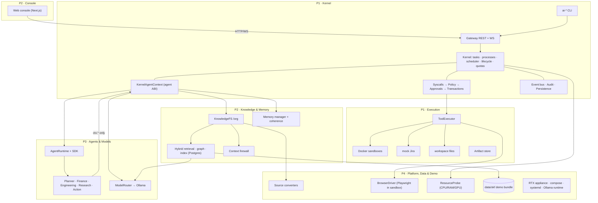

# mOSaic: master plan

> Architecture: [`Mosaic_Preoject_Description.md`](../Mosaic_Preoject_Description.md) ("the blueprint", § numbers) · Folders: [`FOLDER_STRUCTURE.md`](FOLDER_STRUCTURE.md) · Agent rules: [`AGENTS.md`](../AGENTS.md)
> Personal briefs (load these into your coding agent): [P1](team/P1-kernel-execution.md) · [P2](team/P2-knowledge-console.md) · [P3](team/P3-agents-models.md) · [P4](team/P4-platform-data-demo.md)

---

## 0. The team at a glance

Two members use **Claude Code (Opus 5.5)**; two use a chat assistant with the generated context pack (their briefs include code skeletons). Each split owns an interface boundary, and neighbouring splits pair up as review buddies.

| | **P1 Kernel & Execution** | **P2 Knowledge, Memory & Console** | **P3 Agents & Models** | **P4 Platform, Data & Demo** |
|---|---|---|---|---|
| **Tooling** | Claude Code | Claude Code | chat assistant + context pack | chat assistant + context pack |
| **Owns** | `kernel/`, `execution/`*, `mosaicd/`, `policies/` | `knowledge/`*, `apps/`, `agents/.../adapters/` | `agents/`*, `models/`* | `infra/`, `data/`, `scripts/`, `ingestion/`, `browser/`, `gpu/` |
| **Provides** | AgentContext, EventBus, PolicyEngine, AuditLog, ToolExecutor, SandboxManager, ArtifactStore, gateway API, CLI | KnowledgeService, ContextFirewall, MemoryService, web console | ModelRouter, AgentRegistry, AgentRuntime, SDK, 5 agents | SourceConverter, BrowserDriver, ResourceProbe, RTX appliance, demo OKF bundle, demo script |
| **Demo moment** | `ai-ps` live PIDs; kernel **blocks `jira.write`** until approved; verify → commit/rollback | hybrid search with provenance; injected email **flagged**; approval center UI | planner spawns specialists that cite evidence and write the recovery plan | everything runs on **one RTX box** from boot; realistic org data; a browser inside a sandbox |
| **Review buddy** | P4 | P3 | P2 | P1 |

\* minus the sub-folders owned by someone else (see [AGENTS.md](../AGENTS.md) for the exact ownership table).

Everyone starts **today**: every interface has a working fake, the API has a mock server, and every split's contract tests are already wired up. They skip until the split is implemented.

**Buddy pairs share a boundary:** P4's browser driver plugs into P1's executor, and P4's infra runs P1's server. P3's embeddings feed P2's indexes, and P3's agents produce what P2's UI shows. Buddies review each other's PRs and help out when an item slips.

---

## 1. How the split works (read once)

1. **Split along interfaces.** Each person *provides* interfaces and *consumes* others' only through [`shared/`](../shared/README.md). No imports across splits.
2. **Contracts are code.** Pydantic schemas plus `typing.Protocol` interfaces live in `shared/python/mosaic_contracts`. JSON Schema, OpenAPI and TypeScript are generated from them.
3. **Fakes from day zero.** `mosaic_contracts.testing.fakes` has a working version of every interface, so you build against the others' fakes.
4. **Contract tests define "compatible".** `mosaic_contracts.testing.contracts` has one suite per interface. The fake passes it today; your real implementation must pass the same suite. Your `tests/test_contract.py` skips until your factory is implemented, then gates CI.
5. **Integration is a config flip.** `mosaicd/wiring.py` builds each service from `MOSAIC_MODE_<COMPONENT>=fake|real`. A factory that isn't ready falls back to the fake with a warning.
6. **One demo drives everything.** The Apollo run (blueprint §47) is frozen in `examples.py`, replayed by the mock gateway, and asserted by `tests/integration/test_e2e_apollo.py`.

---

## 2. Architecture → ownership



---

## 3. Interface matrix

| Interface | Provider | Consumers | Fake | Contract suite |
|---|---|---|---|---|
| `AgentContext` (agent ABI) | **P1** | P3 agents | `FakeAgentContext` | via `AgentRuntimeContract` |
| `EventBus` · `PolicyEngine` · `AuditLog` | **P1** | all · kernel · UI via API | `InMemoryEventBus` · `FakePolicyEngine` · `InMemoryAuditLog` | `EventBusContract` · `PolicyEngineContract` · `AuditLogContract` |
| Gateway HTTP/WS (`shared/api/openapi.json`) | **P1** | P2 UI, CLI | `mosaic-mock-gateway` | route conformance test |
| `ToolExecutor` · `SandboxManager` · `ArtifactStore` | **P1** | kernel | `FakeToolExecutor` · `FakeSandboxManager` · `InMemoryArtifactStore` | `ToolExecutorContract` · `SandboxManagerContract` · `ArtifactStoreContract` |
| `KnowledgeService` · `ContextFirewall` · `MemoryService` | **P2** | P1 (for agents), UI | `FakeKnowledgeService` · `FakeContextFirewall` · `FakeMemoryService` | `KnowledgeServiceContract` · `ContextFirewallContract` · `MemoryServiceContract` |
| `ModelRouter` | **P3** | P1 context, P2 embeddings | `FakeModelRouter` | `ModelRouterContract` |
| `AgentRegistry` · `AgentRuntime` | **P3** | P1 lifecycle | `FakeAgentRegistry` · `FakeAgentRuntime` | `AgentRegistryContract` · `AgentRuntimeContract` |
| `SourceConverter` | **P4** | P2 ingest | `FakeMarkdownConverter` | `SourceConverterContract` |
| `BrowserDriver` | **P4** | P1 executor | `FakeBrowserDriver` | `BrowserDriverContract` |
| `ResourceProbe` | **P4** | P1 (`/system/resources`, ai-top) | `FakeResourceProbe` | `ResourceProbeContract` |

Shared semantics, one implementation for everyone, live in `mosaic_contracts.util`: `path_allowed`, `capability_matches`, `has_capability`, `privacy_allows`, `org_path_to_okf_file`, `estimate_tokens`.

---

## 4. The demo, step by step (blueprint §47) → owner

| # | Step | Owner(s) |
|---|---|---|
| 1 | User prompt in the composer → `POST /tasks` | P2 UI → P1 gateway |
| 2 | Planner PID appears (`process.spawned`, `ai-ps`) | P1 lifecycle, P3 planner, P2 tree view |
| 3 | Specialists spawn (`ctx.spawn`) | P3 planner → P1 |
| 4 | Knowledge filesystem opens (`ctx.list/read`, scoped) | P1 context → P2 KFS |
| 5 | OKF evidence retrieved; firewall flags the injected email | P2 retrieval + firewall; data by P4 |
| 6 | Memory loaded into the working set | P2 memory, P1 context |
| 7 | Agents collaborate (A2A `ctx.send/receive`) | P3 IPC helpers, P1 mailboxes |
| 8 | Sandbox boots | P1 sandbox manager; image by P4 |
| 9 | Browser action in the sandbox | P4 browser driver via P1 executor; P3 research agent |
| 10 | Kernel blocks the privileged syscall `jira.write` | P3 action agent → **P1 policy** |
| 11 | Human approves in the approval center | **P2 UI** → P1 approvals |
| 12 | Action executes on mock Jira | P1 transactions + executor |
| 13 | Verification runs | P1 |
| 14 | Commit (or rollback on failed verification) | P1 |
| 15 | Audit journal appears | P1 audit → P2 UI |
| 16 | Memory updated (consolidation) | P2, triggered by P1 |
| 17 | Final answer + recovery-plan artifact | P3 planner → P1 → P2 UI |
| – | It all runs on the RTX box, booted by systemd | P4 |

## 5. MVP scope (blueprint §48) → owner

| Must-have | Owner | Strong stretch | Owner |
|---|---|---|---|
| 1 Ubuntu appliance | P4 (P1 recovery) | 15 NOOA adapter | P2 |
| 2 Single RTX server | P4 | 16 Model router | P3 (in MVP) |
| 3 Web client | P2 | 17 A2A messaging | P3 + P1 |
| 4 AI kernel | P1 | 18 Checkpoint/resume | P1 + P3 |
| 5 Planner + 2–3 specialists | P3 | 19 Knowledge invalidation | P2 + P1 |
| 6 OKF repository | P4 content, P2 engine | 20 Mobile client | P4 (or P2) |
| 7 Hybrid retrieval | P2 | 21 `ai-mount` FS shell | P1 |
| 8 Persistent data volume | P4 + P1 | 22 Process tree CLI | P1 |
| 9 Docker sandbox | P1 | 23 MicroVM / OpenShell | P1 |
| 10 Browser/file execution | P4 browser, P1 files | 24 Agent package manager | P3 |
| 11 Capability + policy gate | P1 | | |
| 12 Human approval | P1 + P2 UI | | |
| 13 Audit trail | P1 + P2 UI | | |
| 14 Process dashboard | P2 (+ P1 CLI) | | |

---

## 6. Milestones and integration order

Milestones are **gates**, not dates. For a 7-day build: M1 by the end of day 3, M2 by day 5, M3 by day 6, and M4 plus rehearsal on day 7.

| Gate | P1 | P2 | P3 | P4 |
|---|---|---|---|---|
| **M0 ✅** | contracts v0.2.0, fakes, suites, mock gateway, TS types, skeletons, CI, agent context files | | | |
| **M1: standalone** | kernel on `fake_bundle()`; e2e green all-fake; executor + mock Jira + artifacts + sandbox suites green | knowledge/firewall/memory suites green on Postgres; UI: composer, timeline, tree, approvals on the mock gateway | Ollama router + registry + runtime suites green; planner + 2 specialists unit-tested on `FakeAgentContext` | RTX box ready (drivers, toolkit, Ollama, models); compose up; probe + markdown/jira converters green; `data/okf` ≥ 30 files |
| **M2: pairwise** | runs P3 agents; uses P4 browser; P2 scope filtering via principal | real embeddings from P3 (reindex); ingest pipeline uses P4 converters; UI on the real gateway | agents under the real kernel; research + action agents | browser driver green; slack/csv converters; `data/okf` ≥ 60 files |
| **M3: full e2e** | `MOSAIC_DEFAULT_MODE=real` e2e green on the RTX box; recovery after restart | explorer, audit, monitor, sandbox view; retrieval QA (10 questions) | tuned prompts: correct root causes in < 2 min on local models | systemd boot of the whole stack; demo script rehearsed ×3; backup recording |
| **M4: polish** | checkpoint/resume, Redis Streams, MCP (stretch) | invalidation demo, NOOA (stretch) | A2A clarification loop, OpenAI-compatible provider | mobile thin client (stretch), appliance autoinstall |

**Integration order at M2.** Flip one at a time and run `uv run pytest tests/integration` after each.
1. `MODELS=real` (P3 → P2 reindexes)
2. `KNOWLEDGE,MEMORY,FIREWALL,CONVERTERS=real` (P2 + P4)
3. `AGENTS=real` (P3 + P1)
4. `TOOLS,SANDBOX,ARTIFACTS,BROWSER=real` (P1 + P4)
5. `PROBE=real` (P4)
6. UI → real gateway (P2)

**Critical path:** P1 kernel → e2e. **Soft dependencies:** P3 embeddings → P2 (the fake embeddings suffice until M2); P4 RTX box → everyone's "real" runs (a dev laptop with Ollama on CPU works until then).

---

## 7. Working agreements

- **Branches:** `p1/…`, `p2/…`, `p3/…`, `p4/…`, `contract/…`. `main` is protected and always green. PR checks run ruff, all suites, the e2e test, and a check that generated files are fresh.
- **Reviews:** your buddy reviews your PRs. Contract PRs need the provider plus the consumers (all four if breaking). See `shared/README.md`.
- **Daily 15-minute integration standup:** what you flipped to `real`, what broke, and any contract proposals.
- **Coding agents:**
  - **Claude Code (P1, P2):** `CLAUDE.md` loads `AGENTS.md` automatically. Create `CLAUDE.local.md` containing `@docs/team/P1-kernel-execution.md` (or P2's brief) so the agent always has your brief.
  - **Chat assistants (P3, P4):** run `uv run python scripts/context_pack.py P3` (or `P4`) and paste or upload `.context/P3-context.md` as the first message. Use `--lite` for tools with small context windows. Ask for one module at a time, run the tests locally, and paste failures back.
- **Status:** update your table in `shared/services/<you>.md` with each PR.

---

## 8. Risks and fallbacks

| Risk | Mitigation |
|---|---|
| A split falls behind | Modules are small and contract-tested; the review buddy (P1↔P4, P2↔P3) can help with an item without learning internals. Fakes keep the demo alive meanwhile |
| Local models too slow or weak | `models.yaml` routes cheap tasks to 3B models; planner steps run in parallel; cap at 3 specialists |
| GPU / driver / Docker problems on the RTX box | Start P4's machine setup on day 1. Dev laptops run Ollama on CPU with small models; `FakeSandboxManager` + `FakeBrowserDriver` keep the flow working |
| Retrieval quality | 10 demo questions with expected top-3 evidence become a regression test (P2 + P4) |
| Integration surprises late | Gates M1/M2 force early integration; per-component fallback to fakes in `mosaicd` |
| NOOA not installable | finance-agent falls back to `framework: custom` |
| Live demo failure | Backup recording at M3 (P4); the mock gateway replays the UI flow offline |

---

## 9. Quick start (everyone, day 1)

```bash
git clone https://github.com/Kamalllx/mOSaic && cd mOSaic
uv sync --all-packages && uv run pytest -rs        # your suites say "skipped: not implemented yet"
cp .env.example .env
uv run mosaicd --print-wiring                      # all fake today
uv run mosaic-mock-gateway --speed 4               # API + Apollo replay on :8080/docs
```

| Who | Day-1 first task (from your brief) |
|---|---|
| P1 | T1–T3: process table + lifecycle + context on `fake_bundle()`, until `tests/integration` stops skipping |
| P2 | T1–T3: Postgres schema, OKF loader, indexing; bootstrap `apps/web` on the mock gateway in parallel |
| P3 | T1: Ollama provider + router (P2 needs embeddings); then SDK + planner on `FakeAgentContext` |
| P4 | T1: RTX box setup (drivers → toolkit → compose → Ollama models), then the markdown and jira converters |
